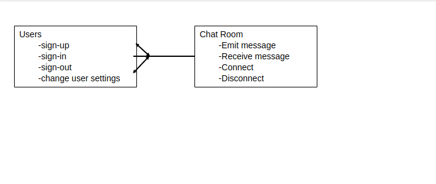
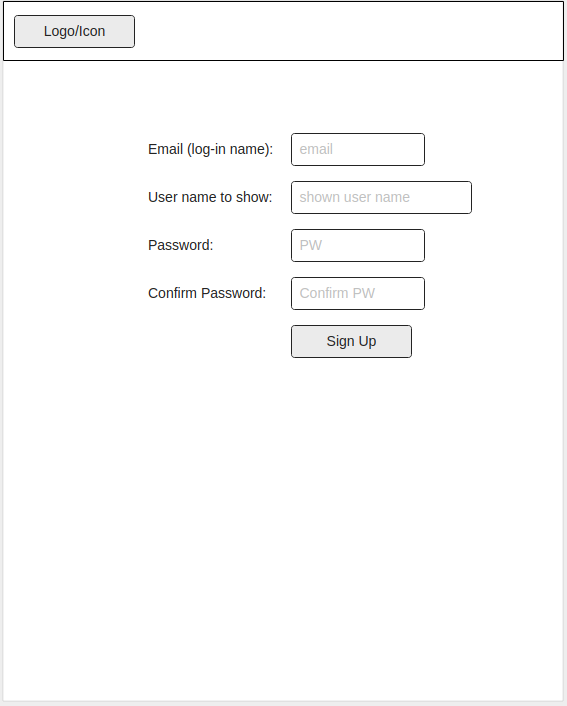
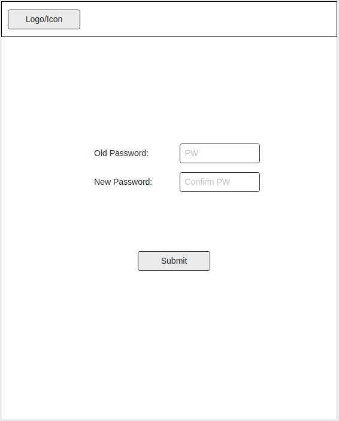
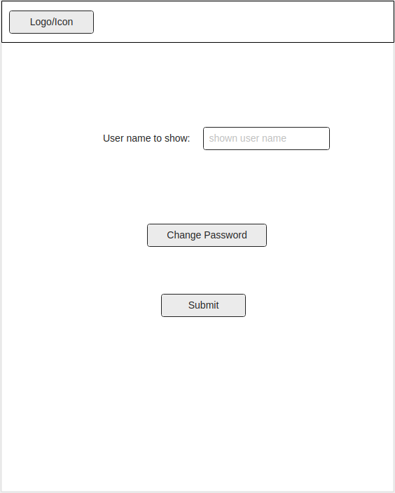
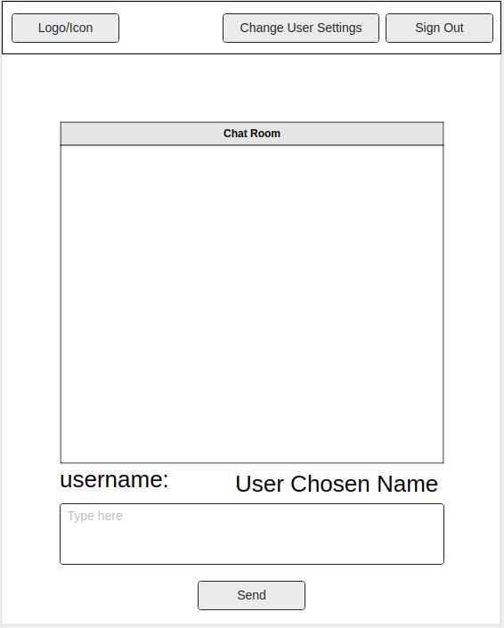

# Project Stardust API

## Links
- [Project Stardust API Repo](https://github.com/GA-The-Empire/project-stardust-api)
- [Project Stardust Client Repo](https://github.com/GA-The-Empire/project-stardust-client)
- [Deployed API](https://fast-headland-53736.herokuapp.com/)
- [Deployed Client](https://ga-the-empire.github.io/project-stardust-client/#/)

## Information
Project Stardust is our chat system where users can make profiles and enter a group chat that connects everyone in the same server. For information on how to use the API, please scroll down below to the *instructions* section. The API wasn't too difficult to set up. The area where we struggled with the most was implementing Socket.IO

## Technology
Here are the technologies we used for the server side of Project Stardust
1. MongoDB
1. Express
1. Node
1. Moongoose
1. Socket.IO
1. cors
1. Passport
1. bcrypt
1. crypto

## Unsolved Problems
- We wanted to make a way to see other people's profiles by clicking their name in the chat. Currently you can only create, read, update and delete your own profile.
- We wanted to implement direct messaging with additional chat rooms
- We wanted to implement friends lists
- We wanted to implement a cover to the exhaust vent

## Images

### ERD (entity relationship diagram)



#### Wireframe:







## Instructions
Here's the instructions on how to use our API

> If TOKEN REQUIRED is set to Yes, please include this in your http request:
> ```javascript
>   --header "Authorization: Token token=${TOKEN}" \
> ```

**USER**
| PURPOSE | EXTENSION | VERB | TOKEN REQUIRED | RETURN OBJECT | RETURN STATUS |
| --- | --- | --- | --- | --- | --- |
| Sign Up | '/sign-up' | 'POST' | NO | User Object | 201 |
| Sign In | '/sign-in' | 'POST' | NO | User Object | 201 |
| Change Password | '/change-password' | 'PATCH' | YES | None | 204 |
| Change Username | '/change-username' | 'PATCH' | YES | User Object | 201 |
| Sign out | '/sign-out' | 'DELETE' | YES | None | 204 |

These are the data format for the api calls

*SIGN UP*
```javascript
{
  "credentials": {
    "userName": <user>,
    "email": <email>,
    "password": <password>,
    "password_confirmation": <password_confirmation>
  }
}
```

*SIGN IN*
```javascript
{
  "credentials": {
    "email": <email>,
    "password": <password>
  }
}
```

*CHANGE PASSWORD*
```javascript
{
  "passwords": {
    "old": <oldPassword>,
    "new": <newPassword>
  }
}
```

*CHANGE USERNAME*
```javascript
{
  "credentials": {
    "userName": <user>
  }
}
```

**PROFILE**
| PURPOSE | EXTENSION | VERB | TOKEN REQUIRED | RETURN OBJECT | RETURN STATUS |
| --- | --- | --- | --- | --- | --- |
| Create | '/profile' | 'POST' | YES | User Object | 201 |
| Show | '/profile/:id' | 'GET' | NO | User.profile Object | None |
| Update | '/profile/:id' | 'PATCH' | YES | NONE | 204 |
| Reset | '/profile/:id' | 'DELETE' | YES | None | 204 |

These are the data format for the api calls

*CREATE*
```javascript
{
      "user": {
        "_id": <userID>,
        "profile": {
          "about": <about> ,
          "avatarUrl": <avatarUrl>,
          "quote": <quote>,
          "rank": <rank>,
          "website": <website>
        }
      }
    }
```

*UPDATE*
```javascript
{
      "user": {
        "_id": <userID>,
        "profile": {
          "about": <about> ,
          "avatarUrl": <avatarUrl>,
          "quote": <quote>,
          "rank": <rank>,
          "website": <website>
        }
      }
    }
```
